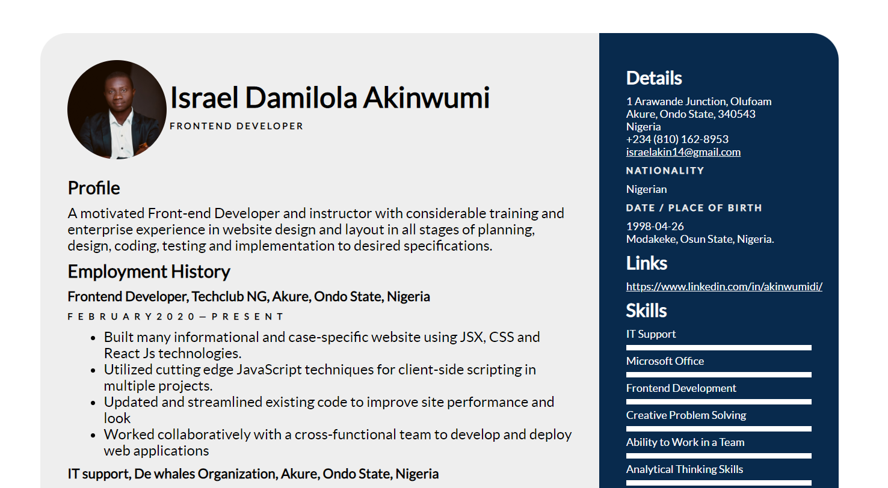

# CVpage
Simple Responsive CV Page

## Netlify Link
- https://cvpage.netlify.app/

# Steps to use Application
- Download Entire code
- Open the Index.html file

Feel free to edit and use as you like, You can also reach out to me, if you need help making it work

# Technologies Used
- HTML
- CSS [ Styling ]

## Special Thanks

Fonts Resources
- Fontsquirrel [ https://www.fontsquirrel.com/ ]
